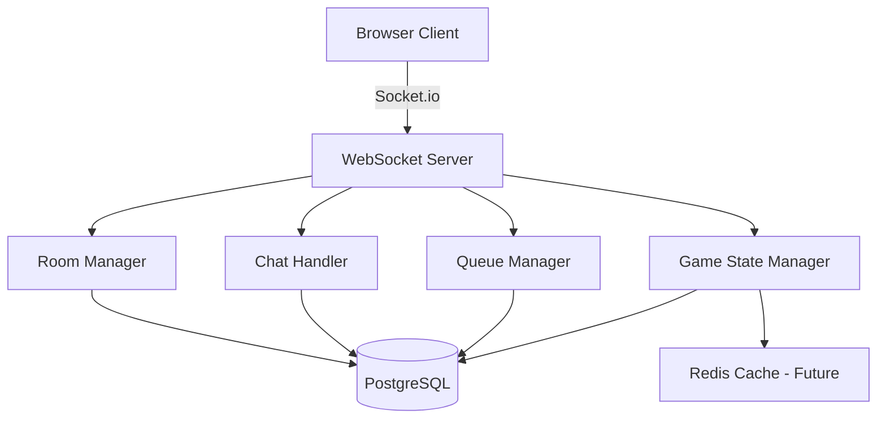

# Charge Circle — Real-Time Multiplayer Turn Board Game

## Project Overview

A real-time multiplayer collaborative grid game where up to **1,000 operators** connect simultaneously, take turns moving a shared **Energy Orb** across a 10×10 board, and cooperate to reach the **Charging Circle** target to score.

- **Single Control:** Only one user can move the piece at a time.
- **Turn Rotation:** After a user moves, they rotate to the back of the FIFO queue.
- **Live Sync:** WebSocket-powered real-time updates for all connected players.
- **Goal:** Guide the Energy Orb to the pulsing Charging Circle to charge the grid (+1 score per charge).

---

## Tech Stack

| Layer | Technology | Purpose |
|-------|-----------|---------|
| Frontend | Next.js + HTML Canvas + Tailwind CSS | UI rendering, game board, real-time client |
| Backend | Node.js + Express + Socket.io | WebSocket server, game logic, queue management |
| Database | PostgreSQL (via `pg`) | Persistent storage for game state, users, chat, move history |
| Containerization | Docker + docker-compose | One-command setup, reproducible environments |
| CI/CD | GitHub Actions | Automated testing, linting, type-checking |
| Testing | Vitest (frontend) + Jest/Supertest (backend) | Unit + integration tests |

---

## Features (MVP + Planned Enhancements)

### ✅ MVP (Implemented)
- 10×10 Canvas grid with cyberpunk neon aesthetic
- Single shared Energy Orb with smooth movement animation
- FIFO turn queue with counter system
- Charging Circle target with pulsing glow effect
- Score tracking (GW charged)
- Move validation (adjacent tiles only, board bounds, turn check)
- Reconnection with 8-second grace period before queue removal
- Hover highlighting (cyan for valid moves, red for invalid)
- Responsive UI with Queue Panel and Personal Console

### 🚀 Enhancement Roadmap

#### 1. Real-Time Chat System
- **In-game chat** alongside the board so players can coordinate.
- Messages broadcast via Socket.io with `send_chat` / `chat_message` events.
- Chat history persisted in PostgreSQL for message retention.
- System messages (e.g., "Player_X scored!", "Player_Y joined the grid").

#### 2. Multiple Game Rooms
- Players can **create or join** named rooms instead of one global board.
- Each room has its own isolated game state, queue, and chat.
- Room listing UI with player count display.
- `create_room` / `join_room` / `leave_room` events.
- Room owner can start/reset the game.

#### 3. PostgreSQL Database (replacing JSON files)
- Proper relational schema: `users`, `game_state`, `rooms`, `chat_messages`, `move_history`.
- Parameterized queries for security.
- Migration files in `backend/migrations/`.
- Connection pooling via `pg` Pool.

#### 4. Move History & Replay
- Every move logged to `move_history` table (player, coordinates, timestamp, room).
- Replay mode: playback the entire move sequence of a game session.
- Step-forward/step-backward controls in replay UI.

#### 5. Docker + docker-compose
- `Dockerfile` for frontend and backend.
- `docker-compose.yml` wiring frontend, backend, PostgreSQL.
- `.env` configuration with sensible defaults.
- One command: `docker compose up` to run everything.

#### 6. Test Suite
- **Backend:** Unit tests for queue logic, move validation; integration tests for Socket.io events and API endpoints.
- **Frontend:** Component tests for GameGrid, QueuePanel; hook tests for socket connection logic.
- Coverage reporting.

#### 7. GitHub Actions CI/CD
- Run tests, linting, type-checking on every push/PR.
- Optional: Docker image build and push.

#### 8. Admin Dashboard
- Real-time analytics: active connections, moves/sec, score history.
- Room management (view/cancel games).
- Basic moderation (kick, mute).

---

## Database Schema (PostgreSQL)

```sql
CREATE TABLE users (
  id          TEXT PRIMARY KEY,
  username    TEXT,
  created_at  TIMESTAMP DEFAULT NOW()
);

CREATE TABLE rooms (
  id          TEXT PRIMARY KEY,
  name        TEXT NOT NULL,
  owner_id    TEXT REFERENCES users(id),
  status      TEXT DEFAULT 'waiting', -- waiting, playing, finished
  board_size  INT DEFAULT 10,
  created_at  TIMESTAMP DEFAULT NOW()
);

CREATE TABLE game_state (
  room_id     TEXT PRIMARY KEY REFERENCES rooms(id),
  piece_x     INT DEFAULT 4,
  piece_y     INT DEFAULT 4,
  target_x    INT DEFAULT 2,
  target_y    INT DEFAULT 7,
  score       INT DEFAULT 0,
  turn_queue  JSONB -- ordered array of player IDs
);

CREATE TABLE chat_messages (
  id          SERIAL PRIMARY KEY,
  room_id     TEXT REFERENCES rooms(id),
  user_id     TEXT REFERENCES users(id),
  message     TEXT NOT NULL,
  created_at  TIMESTAMP DEFAULT NOW()
);

CREATE TABLE move_history (
  id          SERIAL PRIMARY KEY,
  room_id     TEXT REFERENCES rooms(id),
  user_id     TEXT REFERENCES users(id),
  from_x      INT,
  from_y      INT,
  to_x        INT,
  to_y        INT,
  scored      BOOLEAN DEFAULT FALSE,
  created_at  TIMESTAMP DEFAULT NOW()
);
```

---

## Backend Events

### Client → Server
| Event | Payload | Description |
|-------|---------|-------------|
| `join_game` | `{ userId }` | Join the game queue |
| `move_piece` | `{ x, y }` | Attempt to move the Energy Orb |
| `send_chat` | `{ roomId, message }` | Send a chat message |
| `create_room` | `{ name }` | Create a new game room |
| `join_room` | `{ roomId }` | Join an existing room |
| `leave_room` | `{ roomId }` | Leave a room |

### Server → Client
| Event | Payload | Description |
|-------|---------|-------------|
| `game_state` | Full board + queue state | Broadcast on every state change |
| `grid_charged` | `{ score, nextTarget }` | Emitted when a player scores |
| `chat_message` | `{ userId, message, timestamp }` | New chat broadcast |
| `room_list` | Array of rooms | Available rooms listing |
| `error_message` | `{ message }` | Validation errors |

---

## Backend Architecture



### Module Responsibilities
1. **WebSocket Server:** Connection management, event routing, broadcasting.
2. **Queue Manager:** FIFO queue rotation, turn validation, counter updates.
3. **Game State Manager:** Piece position, target spawning, score tracking, move validation.
4. **Chat Handler:** Message relay, persistence, system messages.
5. **Room Manager:** Room lifecycle, isolated game instances, room listing.
6. **Database Layer:** PostgreSQL connection pool, parameterized queries, migrations.

---

## Scalability & Performance

- **In-memory game state** with periodic PostgreSQL persistence (not on every move).
- **Socket.io rooms** isolate broadcasts per game room (avoids global fan-out).
- **Rate limiting** on move_piece and chat events to prevent spam.
- **Connection pooling** for PostgreSQL to handle concurrent reads/writes.
- **Future:** Redis pub/sub for horizontal scaling across multiple Node.js instances.

---

## Running the Project

```bash
# One-command setup (requires Docker)
docker compose up

# Or run manually:
# Backend
cd backend && npm install && npm run dev

# Frontend
cd frontend && npm install && npm run dev

# PostgreSQL must be running locally on port 5432
```
