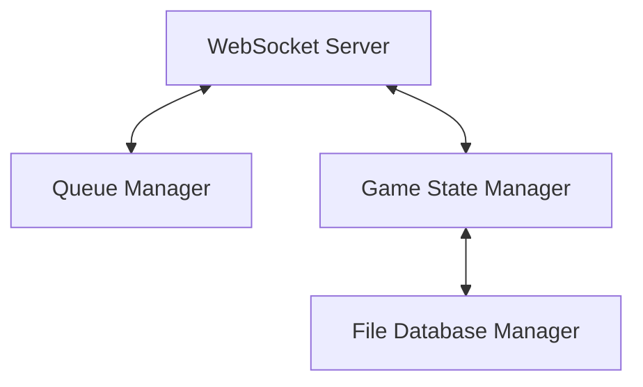

# Real-Time Multiplayer Turn Board Game — Simple PRD

## Project Overview

This project is a real-time multiplayer board application where up to 1,000 users connect to a shared board and control a single game piece together.

- **Single Control:** Only one user can move the piece at a time.
- **Turn Rotation:** After a user moves the piece:
  - Their turn becomes unavailable.
  - They enter the back of the queue.
  - They must wait until every other connected player has had their turn.
- **Live Sync:** The application updates live for every connected player using WebSockets.

### Tech Stack Overview
* **Frontend:** Next.js + HTML Canvas
* **Backend:** Node.js + WebSocket server
* **Database:** Simulated using local JSON files

---

## 1. Main Goal

Build a simple real-time collaborative board system where:
- Up to **1,000 users** can connect simultaneously.
- There is only **one movable piece** on the board.
- Users take turns moving the piece.
- All users see movements live.
- Turns rotate automatically.

> [!NOTE]
> Think of this as a "shared chess piece", a "mass multiplayer turn queue", or a "collaborative live board".

---

## 2. Core Gameplay Logic

### The Board
- Grid-based layout (e.g., $10 \times 10$ board).
- Rendered using HTML5 Canvas.
- Contains exactly **one** shared piece.

### The Piece
- Has `x` and `y` coordinates representing its tile position.
- Moves tile-by-tile.
- Can only be moved by the active player.
- **Example State:**
  ```json
  {
    "x": 4,
    "y": 7
  }
  ```

---

## 3. User Turn System

This is the most critical part of the application.

### Turn Queue
Every connected player enters a FIFO (First-In, First-Out) queue.
For example, with players: `[Player 1, Player 2, Player 3, Player 4]`:
1. **Player 1** is active and makes a move.
2. **Player 1** is moved to the back of the queue.
3. The queue becomes: `[Player 2, Player 3, Player 4, Player 1]`.
4. Now, **Player 2** is active and can move.

---

## 4. User State Structure

Each user connection maintains the following state structure:

```json
{
  "id": "user_1",
  "myTurn": false,
  "counter": 5
}
```

### Fields Description
* **`id`** `(string)`: Unique player identifier.
* **`myTurn`** `(boolean)`:
  - `true`: User can move now.
  - `false`: Waiting for turn.
* **`counter`** `(integer)`: Represents how many turns have passed since this user last played (or distance from their turn).
  - `0`: Current active player.
  - Large value (e.g., `999` in a 1,000-user game): Indicates they are close to the front of the queue, or far from their last turn.

---

## 5. Turn Rotation Flow

Let's illustrate the state changes with 4 users ($P_1, P_2, P_3, P_4$):

### 1. Initial State
- $P_1$ is active.
- Queue: $P_1 \to P_2 \to P_3 \to P_4$.

### 2. $P_1$ Moves
Backend updates piece position, increments all counters, rotates queue, and resets the new active player's counter to `0`.
- **Result:**
  | User | Counter | Active Turn (`myTurn`) |
  | :--- | :-----: | :--------------------: |
  | **$P_1$** | 1 | `false` |
  | **$P_2$** | 0 | `true` (Active) |
  | **$P_3$** | 1 | `false` |
  | **$P_4$** | 1 | `false` |

### 3. $P_2$ Moves
- **Result:**
  | User | Counter | Active Turn (`myTurn`) |
  | :--- | :-----: | :--------------------: |
  | **$P_1$** | 2 | `false` |
  | **$P_2$** | 1 | `false` |
  | **$P_3$** | 0 | `true` (Active) |
  | **$P_4$** | 2 | `false` |

---

## 6. Real-Time Requirements

The application MUST update instantly. When any user moves:
- All users must immediately see:
  - The new piece position (with smooth movement animations).
  - The updated turn queue.
  - The updated turn counters.
  - The current active player.
- **WebSocket Protocol** is required to meet these real-time requirements.

---

## 7. Technology Stack

### Frontend
- **Framework:** Next.js
- **Responsibilities:**
  - Rendering UI and layout.
  - HTML Canvas rendering for the game board.
  - Managing socket connections (listening to state updates, emitting moves).
  - Visualizing the queue, counters, and active player indicator.
  - Handling user clicks and board interactions.

### Backend
- **Framework:** Node.js
- **Responsibilities:**
  - Managing the queue and active turn state.
  - Validating incoming move requests.
  - Synchronizing user connections.
  - Broadcasting state updates to all connected clients.
  - Storing state persistency in JSON database files.

### Real-Time Communication
- **Library:** WebSocket (`ws` or `socket.io`)
- **Recommendation:** `socket.io`
  - *Reasons:* Out-of-the-box support for rooms/namespaces, automatic reconnect handling, custom event firing, and better scalability.

---

## 8. Canvas Requirements

Use HTML5 Canvas to render:
- Grid board layout (e.g., $10 \times 10$ squares).
- The shared piece (represented as a circle, square token, or chess icon).
- Movement animations (smooth transitions instead of instant jumps).
- Click handlers:
  - Only the active player can click a valid adjacent/destination tile to trigger a move.

---

## 9. Backend Architecture

The backend consists of four primary modules:



1. **WebSocket Server:** Handles incoming socket connections, client authentication, and broadcasting state.
2. **Queue Manager:** Manages the order of players and handles queue rotation.
3. **Game State Manager:** Maintains the coordinate position of the piece, updates player counters, and validates moves.
4. **File Database Manager:** Periodically reads/writes to JSON files to persist state.

---

## 10. JSON Database Structure

### Directory Layout
```text
/database
  ├── users.json
  └── game.json
```

### `users.json`
Stores the list of users, their turn status, and counter values.
```json
[
  {
    "id": "user_1",
    "myTurn": true,
    "counter": 0
  }
]
```

### `game.json`
Stores the shared board state and configuration.
```json
{
  "piece": {
    "x": 3,
    "y": 5
  },
  "boardSize": 10
}
```

---

## 11. Backend Events

### Client → Server Events
* **`join_game`**: Emitted when a user connects and enters the queue.
* **`move_piece`**: Emitted when a user attempts to move the piece to a new location.
  - *Payload:*
    ```json
    {
      "x": 4,
      "y": 6
    }
    ```

### Server → Client Events
* **`game_state`**: Sends the full updated board and queue state.
* **`turn_changed`**: Notifies clients that a new player is active.
* **`piece_moved`**: Updates the piece location on the board.

---

## 12. Move Validation Rules

The backend must validate every movement request before applying it:
1. **Turn Validation:** Only the active player (`myTurn === true`) is authorized to move. Reject any moves from other players.
2. **Board Boundary Validation:** The piece cannot be moved outside the grid boundaries (e.g., coordinates must stay within $[0, \text{boardSize} - 1]$).
3. **Movement Distance (Optional/MVP Rules):**
  - *MVP Simple Rule:* Move to any tile (simplest initial version).
  - *Alternative Rule:* Restrict movements to adjacent tiles (1 square distance). Keep it simple initially.

---

## 13. UI Requirements

The main game screen should contain:
- **Canvas Board:** Large, central, responsive grid board.
- **Current Player Indicator:** Shows who is currently playing (e.g., `Current Turn: User_24`).
- **Personal Status Panel:**
  - `Your Turn: YES/NO`
  - `Counter: 456`
  - `Queue Position: 457`
- **Online Stats:** Shows the total count of connected players (e.g., `Users Online: 843`).

---

## 14. Scaling for 1,000 Users

Managing 1,000 simultaneous connections is a notable scale constraint. The system should use these optimization strategies:

- **Keep State Payloads Minimal:** Do not broadcast large datasets. Send only the piece coordinates, active player ID, and list of counters.
- **Efficient Broadcasting:** Avoid re-rendering the entire DOM/Canvas on the client. Perform delta updates.
- **In-Memory Game State:**
  - Do *not* read or write to the JSON file database on every single move.
  - Load the state from JSON files once at server startup.
  - Maintain the active game state in memory.
  - Periodically auto-save/flush memory state back to JSON files.

---

## 15. Architecture & Gameplay Flow

```mermaid
sequenceDiagram
    autonumber
    actor Client as User Client
    participant Server as WS Backend
    database DB as JSON Database

    Server->>DB: Load initial game & player state
    Client->>Server: Connect & emit "join_game"
    Server->>Client: Send current "game_state" & add to queue
    Note over Client,Server: User waits for turn (counter decreases)
    Note over Client,Server: It is the User's turn (myTurn = true)
    Client->>Server: Click tile & emit "move_piece"
    Server->>Server: Validate turn and move
    Server->>DB: Periodically persist state
    Server->>Client: Broadcast updated state to all users
```
