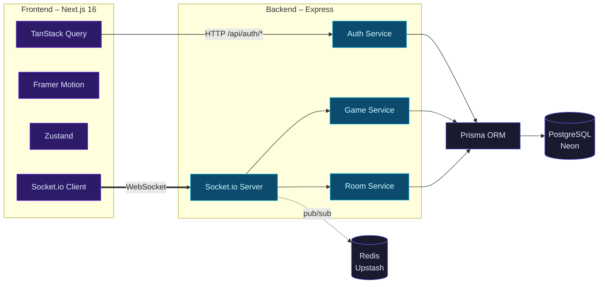

# Charge Circle ⚡

**Real-Time Multiplayer Collaborative Grid Game**

> **Live**: [charge-circle-frontend.onrender.com](https://charge-circle-frontend.onrender.com) — create an account, join a room, start a round.

A simultaneous-play grid game where operators navigate Energy Orbs across a shared board to charge the circle. Built with reactive architecture — every player moves independently, sees their own targets and scores in real time, and competes on a live leaderboard.

> No turn queue. No waiting. Every move counts instantly.

---

## Architecture Overview



---

## Table of Contents

- [Features](#features)
- [Tech Stack](#tech-stack)
- [Backend Architecture](#backend-architecture)
  - [Project Structure](#backend-project-structure)
  - [Database Schema](#database-schema)
  - [Authentication Flow](#authentication-flow)
  - [Socket Events](#socket-events)
  - [Game Logic](#game-logic)
  - [Broadcast System](#broadcast-system)
- [Frontend Architecture](#frontend-architecture)
  - [Project Structure](#frontend-project-structure)
  - [State Management](#state-management)
  - [Custom Hooks](#custom-hooks)
  - [Component Tree](#component-tree)
  - [Toast System](#toast-system)
- [Quick Start](#quick-start)
- [Environment Variables](#environment-variables)
- [Deployment](#deployment)
- [CI/CD](#cicd)
- [Key Decisions](#key-decisions)

---

## Features

- **Simultaneous per-player game state** — each player has an independent Energy Orb, target, and score. No turn queue.
- **Timed 60-second rounds** — rounds auto-start and auto-end with leaderboard broadcast.
- **Live leaderboard** — broadcast to all room members every 5 seconds during active rounds.
- **Real-time chat** — optimistic broadcasting with async persistence.
- **JWT access/refresh token auth** — 15-minute access tokens, opaque refresh tokens with SHA-256 hashing and rotation.
- **Per-device logout** — token rotation enables single-device revocation.
- **Canvas-rendered game board** — smooth grid with animated pieces, pulsing targets, and coordinate labels.
- **Throttled broadcasts** — per-player deltas flushed every 50ms, moves throttled at 200ms per user.
- **Toast notifications** — replacing native `alert()` with animated, auto-dismissing, accessible toasts.
- **Framer Motion animations** — slide-in modals, leaderboards, toasts, and page transitions.
- **Dark theme** — Tailwind CSS v4 with consistent design tokens.
- **Docker + Render deployment** — Docker Compose for local dev, Render for production.

---

## Tech Stack

### Backend (`backend/`)

| Category | Choice |
|----------|--------|
| Runtime | Node.js 22 (ESM) |
| Framework | Express 4 |
| Real-time | Socket.io 4 with Redis adapter |
| Database | PostgreSQL via Neon Serverless (WebSocket) |
| ORM | Prisma 7 |
| Cache/Pub-Sub | Redis via Upstash (TCP, required) |
| Auth | JWT (jsonwebtoken) + bcrypt |
| Validation | Zod 4 |
| Logging | Winston |
| Rate Limiting | express-rate-limit |
| Language | TypeScript 5 (ES2022 target) |
| Linting | ESLint 9 flat config + `@typescript-eslint` |

### Frontend (`frontend/`)

| Category | Choice |
|----------|--------|
| Framework | Next.js 16 (App Router, standalone output) |
| UI Library | React 19 |
| Styling | Tailwind CSS 4 |
| Animation | Framer Motion 12 |
| Server State | TanStack Query 5 |
| Client State | Zustand 5 |
| Form Validation | Zod 4 |
| Icons | Lucide React |
| Real-time Client | Socket.io Client 4 |
| Language | TypeScript 5 |

---

## Backend Architecture

### Backend Project Structure

```
backend/
├── prisma/
│   ├── schema.prisma          # Database schema (6 models)
│   └── migrations/            # Prisma migration history
├── src/
│   ├── server.ts              # Entry point — listen + graceful shutdown
│   ├── app.ts                 # Express + Socket.io config, CORS, routes
│   ├── config/
│   │   └── env.ts             # Centralized env validation (exit on missing)
│   ├── controllers/
│   │   └── auth.controller.ts # HTTP auth endpoints (thin delegates)
│   ├── services/
│   │   ├── auth.service.ts    # Signup, login, token rotation, revocation
│   │   ├── room.service.ts    # CRUD rooms, join/leave, start/end round
│   │   ├── game.service.ts    # Move validation + atomic state update
│   │   ├── chat.service.ts    # Persist chat messages
│   │   └── broadcast.service.ts # Throttled delta flush + leaderboard ticker
│   ├── socket/
│   │   ├── auth.socket.ts     # JWT verification on connection
│   │   ├── room.handler.ts    # get_rooms, create, join, leave, update, delete, start_round
│   │   ├── game.handler.ts    # move_piece
│   │   └── chat.handler.ts    # send_chat (optimistic broadcast)
│   ├── dto/
│   │   ├── auth.dto.ts        # SignupDto, LoginDto, RefreshDto, LogoutDto
│   │   ├── room.dto.ts        # CreateRoomDto, JoinRoomDto, UpdateRoomDto, DeleteRoomDto
│   │   ├── game.dto.ts        # MovePieceDto
│   │   └── chat.dto.ts        # SendChatDto
│   ├── middleware/
│   │   ├── validate.middleware.ts # Zod body parser with async transforms
│   │   └── auth.middleware.ts     # Bearer JWT verification
│   ├── routes/
│   │   └── auth.routes.ts     # POST /api/auth/* (signup, login, refresh, logout)
│   ├── types/
│   │   ├── auth.types.ts      # TokenPayload, AuthResult
│   │   ├── room.types.ts      # RoomWithDetails, RoomListItem
│   │   ├── game.types.ts      # MoveResult, GameStateDelta, LeaderboardEntry
│   │   └── chat.types.ts      # ChatMessageWithUser
│   └── utils/
│       ├── logger.ts          # Winston — console only in production
│       ├── jwt.ts             # signAccessToken, verifyAccessToken, generateRefreshToken
│       ├── api.response.ts    # Standardized REST response helpers
│       ├── socket.response.ts # Socket.io broadcast + ack helpers
│       ├── errors.ts          # AppError class
│       ├── helpers.ts         # getRoomLeaderboard, randomizeTarget
│       ├── throttle.ts        # Per-user socket event throttling
│       ├── prisma.ts          # Prisma client + Neon adapter + DB keepalive
│       └── redis.ts           # Redis client + Socket.io adapter setup
├── Dockerfile                 # Multi-stage (build + runner, node:22-alpine)
├── prisma.config.ts           # Prisma CLI datasource config
├── tsconfig.json              # ES2022, NodeNext, strict
└── eslint.config.mjs          # ESLint 9 flat config
```

### Database Schema

6 models with cascade deletes and composite primary keys:

```
User
├── id: String (CUID) @id
├── nickname: String
├── email: String @unique
├── passwordHash: String
└── createdAt: DateTime
    │
    ├── 1:N Room (owner)
    ├── 1:N GameState
    ├── 1:N ChatMessage
    ├── 1:N MoveHistory
    └── 1:N RefreshToken

Room
├── id: String (CUID) @id
├── name: String
├── ownerId: String
├── status: RoomStatus (lobby | active | finished)
├── boardSize: Int (default 10)
├── maxPlayers: Int? (null = unlimited)
├── roundEndsAt: DateTime?
└── createdAt: DateTime
    │
    ├── 1:N GameState
    ├── 1:N ChatMessage
    └── 1:N MoveHistory

GameState          @id([roomId, userId])
├── roomId: String
├── userId: String
├── pieceX: Int
├── pieceY: Int
├── targetX: Int
├── targetY: Int
└── score: Int

RefreshToken
├── id: String (CUID) @id
├── tokenHash: String @unique (SHA-256 of opaque token)
├── userId: String
├── expiresAt: DateTime
├── createdAt: DateTime
└── revokedAt: DateTime?

ChatMessage        (autoincrement id)
├── id: Int @id @default(autoincrement())
├── roomId: String
├── userId: String
├── message: String
└── createdAt: DateTime

MoveHistory        (autoincrement id)
├── id: Int @id @default(autoincrement())
├── roomId: String
├── userId: String
├── fromX, fromY: Int?
├── toX, toY: Int
├── scored: Boolean
└── createdAt: DateTime
```

### Authentication Flow

```
1. Signup / Login
   ──────────────
   Client → POST /api/auth/signup (or /login)
   Server → validates with Zod DTO (stripHtml, normalize email)
          → bcrypt hash / compare
          → signAccessToken(userId, nickname)  [15m JWT]
          → generateRefreshToken()             [40-byte random]
          → SHA-256 hash stored in refresh_tokens table
   Server ← { accessToken, refreshToken, user }

2. API Requests
   ─────────────
   Client → Authorization: Bearer <accessToken>
   Server → verifyAccessToken(token) [stateless JWT verify]
          → attaches userId to req

3. Socket.io Connection
   ────────────────────
   Client → io(url, { auth: { token: accessToken } })
   Server → socketAuthMiddleware verifies JWT
          → attaches userId + nickname to socket instance
          → socket joins rooms on create/join
          → auto-leaves rooms on disconnect

4. Token Refresh (rotation)
   ─────────────────────────
   Client → POST /api/auth/refresh { refreshToken }
   Server → SHA-256 hash → find in DB
          → check not revoked, not expired
          → revoke old token
          → issue new pair
   Server ← { accessToken, refreshToken, user }

5. Logout
   ──────
   Client → POST /api/auth/logout { refreshToken }
   Server → SHA-256 hash → revoke
          → token can no longer be used for refresh
```

### Socket Events

#### Server → Client

| Event | Target | Payload | Frequency |
|-------|--------|---------|-----------|
| `room_state_update` | Room | Full `RoomWithDetails` object | On join/update |
| `player_delta:{userId}` | Player | `GameStateDelta` (piece, target, score) | Every 50ms (batched) |
| `chat_message` | Room | `ChatMessage` with nickname | On send (optimistic) |
| `leaderboard_update` | Room | `{ leaderboard: LeaderboardEntry[] }` | Every 5s (active rounds only) |
| `round_start` | Room | `{ room: Room }` | Owner starts round |
| `round_end` | Room | `{ leaderboard: LeaderboardEntry[] }` | After 60s timeout |
| `room_deleted` | Room | `{ roomId: string }` | Owner deletes room |
| `rooms_updated` | Global (all) | `null` | Any room mutation |
| `game_error` | Player | `{ message: string }` | Validation errors |

#### Client → Server

| Event | Handler | Throttle | Ack |
|-------|---------|----------|-----|
| `get_rooms` | room.handler | — | `{ rooms: Room[] }` |
| `create_room` | room.handler | — | `{ room: Room }` |
| `join_room` | room.handler | — | `{ room: RoomWithDetails }` |
| `leave_room` | room.handler | — | `{ success: boolean }` |
| `update_room` | room.handler | — | `{ room: Room }` |
| `delete_room` | room.handler | — | `{ success: boolean }` |
| `start_round` | room.handler | — | `{ success: boolean }` |
| `move_piece` | game.handler | 200ms/user | — (delta via `player_delta`) |
| `send_chat` | chat.handler | 500ms/user | — (optimistic broadcast) |

### Game Logic

The core gameplay loop is a simultaneous-play model:

```
1. Owner starts round → room.status = 'active', roundEndsAt = now + 60s
2. Each player has their own GameState row:
   - pieceX, pieceY → current position (starts at board center)
   - targetX, targetY → goal position (randomly placed)
   - score → total captures this round
3. Player emits move_piece { roomId, toX, toY }
4. Server validates:
   - Round is active
   - Destination within board bounds (0..boardSize-1)
   - Move is within 1 tile of current position (Chebyshev distance ≤ 1)
5. Server atomically updates GameState:
   - If piece lands on target → score +1, randomise new target
   - Otherwise → just move piece
6. Delta queued for per-player broadcast (flushed every 50ms)
7. After 60s → round auto-ends, status → 'lobby', leaderboard broadcast
```

### Broadcast System

The `BroadcastService` is the central nervous system.

- **Per-player deltas**: Moves are queued in a `Map<string, GameStateDelta>` keyed by `roomId:userId`. Every 50ms, all queued deltas are flushed — each one is sent to the specific player via `player_delta:{userId}`.
- **Leaderboard ticker**: Every 5 seconds, queries all rooms with `status = 'active'`, computes the leaderboard (scores ordered descending), and broadcasts to each room.
- **Global updates**: Any room mutation (create, join, leave, update, delete) broadcasts `rooms_updated` to all connected sockets, triggering cache invalidation on the lobby page.

---

## Frontend Architecture

### Frontend Project Structure

```
frontend/
├── app/
│   ├── layout.tsx              # Root layout — fonts, providers, metadata
│   ├── page.tsx                # Landing page (Hero, Features, CTA, Footer)
│   ├── providers.tsx           # QueryClientProvider + Toaster
│   ├── globals.css             # Tailwind v4 + custom scrollbar styles
│   ├── (auth)/
│   │   ├── login/page.tsx      # Login form with useForm + useLoginMutation
│   │   └── signup/page.tsx     # Signup form with useForm + useSignupMutation
│   ├── lobby/page.tsx          # Room browser (card list, create/edit modals)
│   ├── game/page.tsx           # Main game (canvas, leaderboard, chat, HUD)
│   ├── types/index.ts          # Shared interfaces (User, Room, GameState, etc.)
│   ├── stores/
│   │   ├── ui.store.ts         # Zustand — chatOpen, toggleChat
│   │   └── toast.store.ts     # Zustand — Toast queue management
│   ├── hooks/
│   │   └── useViewport.ts      # Resize observer for canvas sizing
│   └── components/
│       ├── ui/                 # Design system primitives
│       │   ├── index.ts        # Barrel export
│       │   ├── Button.tsx      # 5 variants, loading state, icon slots
│       │   ├── Input.tsx       # Label, error, icon, forwardRef
│       │   ├── Card.tsx        # 3 variants (glass, bordered, flat)
│       │   ├── Modal.tsx       # Animated overlay + sheet with Framer Motion
│       │   ├── Badge.tsx       # 5 variants with optional dot indicator
│       │   ├── ConnectionBadge.tsx  # Grid Live / Reconnecting indicator
│       │   ├── LoadingSpinner.tsx   # Bouncing dots with optional fullScreen
│       │   ├── Logo.tsx        # Gradient "C" logo
│       │   └── Toast.tsx       # Toaster + toast imperative API
│       ├── game/
│       │   ├── GameGrid.tsx    # Canvas-rendered board with animations
│       │   ├── HUDOverlay.tsx  # Chat toggle + slide-in drawer
│       │   ├── Leaderboard.tsx # Scrollable ranked list with medal icons
│       │   └── RoundTimer.tsx  # Animated progress bar with countdown
│       ├── lobby/
│       │   ├── RoomCard.tsx    # Room preview card with stats
│       │   ├── CreateRoomModal.tsx  # Form + FAB trigger
│       │   ├── EditRoomModal.tsx    # Pre-filled edit form
│       │   └── StatStrip.tsx   # Animated stats bar (players, rooms, etc.)
│       ├── landing/
│       │   ├── LandingCanvas.tsx    # Background particle animation
│       │   ├── HeroSection.tsx      # Main CTA with animated gradients
│       │   ├── HowItWorksSection.tsx
│       │   ├── FeaturesSection.tsx
│       │   ├── StatsSection.tsx     # Animated counters
│       │   ├── CtaSection.tsx
│       │   └── Footer.tsx
│       ├── layout/
│       │   ├── AuthFormCard.tsx     # Auth page wrapper with branding
│       │   └── ScrollReveal.tsx     # Intersection Observer animation
│       ├── animated/
│       │   └── AnimatedCounter.tsx  # Number animation on scroll
│       ├── particles/
│       │   └── ParticleCanvas.tsx   # Interactive mouse-follow particles
│       └── chat/
│           └── ChatPanel.tsx        # Message list + input with send
├── hooks/
│   ├── useSocket.ts           # Socket.io client lifecycle
│   ├── useAuth.ts             # Auth state + localStorage + refresh
│   ├── useAuthMutations.ts    # TanStack Query mutations
│   ├── useGameSocket.ts       # Game event listeners + emits
│   ├── useRoomOperations.ts   # Room CRUD emits
│   ├── useChatSocket.ts       # Chat send emit
│   ├── useRoomList.ts         # TanStack Query for room list
│   └── useForm.ts             # Generic Zod-validated form handler
├── lib/
│   ├── api.ts                 # HTTP client with auto-refresh on 401
│   ├── queryClient.ts         # TanStack Query client config
│   └── validations.ts         # Zod schemas (login, signup, createRoom)
├── .env.example               # Environment variable template
├── Dockerfile                 # Multi-stage (standalone output)
├── next.config.ts             # output: 'standalone'
├── tsconfig.json
├── eslint.config.mjs
└── postcss.config.mjs         # Tailwind v4 PostCSS plugin
```

### State Management

The project uses a **layered state approach**:

| Layer | Tool | Scope | Examples |
|-------|------|-------|----------|
| **Server state** | TanStack Query | API-derived data that must stay in sync with the server | Room list (fetched via socket + invalidated on `rooms_updated`), auth mutations |
| **Client state** | Zustand | Transient UI state that doesn't need server sync | `chatOpen` toggle, toast queue |
| **Local state** | `useState` | Component-specific ephemeral state | Form values, hover tile, canvas size |
| **Socket state** | Custom hooks | Connection lifecycle + event binding | `useSocket`, `useGameSocket`, `useRoomOperations` |
| **Auth state** | Custom hook + localStorage | Persisted session across page loads | `useAuth` reads user/tokens from localStorage on mount |

### Custom Hooks

| Hook | Lines | Returns | Key Dependencies |
|------|-------|---------|------------------|
| `useSocket` | 62 | `{ socket, connected }` | None (singleton lifecycle) |
| `useAuth` | 74 | `{ user, loading, login, logout, refreshTokens }` | None (reads localStorage) |
| `useAuthMutations` | 37 | `useSignupMutation()`, `useLoginMutation()` | TanStack Query |
| `useForm` | 60 | `{ values, errors, isSubmitting, handleChange, handleSubmit, reset }` | Zod schema |
| `useGameSocket` | 115 | `{ emitMove, emitLeaveRoom, emitStartRound }` | 7+ callback deps |
| `useRoomOperations` | 67 | `{ createRoom, joinRoom, updateRoom, deleteRoom }` | Socket + router |
| `useChatSocket` | 11 | `{ sendMessage }` | Socket |
| `useRoomList` | 39 | `UseQueryResult<Room[]>` | Socket + TanStack Query |
| `useViewport` | 14 | `{ width, height }` | None |

#### Socket Hook Flow

```
useSocket (manages io() connection lifecycle)
  ├── useAuth → provides refreshTokens ref for re-auth on 401
  └── exposes { socket, connected }
       ├── useGameSocket (game page)
       │   ├── on connect + roomId exists → emit join_room
       │   ├── listens: room_state_update, player_delta:{userId},
       │   │           chat_message, leaderboard_update, round_start/end,
       │   │           game_error, room_deleted
       │   └── emits: move_piece, leave_room, start_round
       ├── useRoomOperations (lobby page)
       │   └── emits: create_room, join_room, update_room, delete_room
       ├── useChatSocket (ChatPanel)
       │   └── emits: send_chat
       └── useRoomList (lobby page)
           └── emits: get_rooms + listens: rooms_updated
```

### Component Tree

```
RootLayout
└── Providers (QueryClientProvider + Toaster)
    ├── LandingPage (unauthenticated)
    │   └── HeroSection → FeaturesSection → StatsSection → CtaSection → Footer
    ├── LoginPage
    │   └── AuthFormCard → Form (useForm + useLoginMutation)
    ├── SignupPage
    │   └── AuthFormCard → Form (useForm + useSignupMutation)
    ├── LobbyPage (authenticated)
    │   ├── RoomCard[] (room list from useRoomList)
    │   ├── StatStrip
    │   ├── CreateRoomModal (useForm + useRoomOperations)
    │   ├── EditRoomModal (useForm + useRoomOperations)
    │   └── ConnectionBadge
    └── GamePage (authenticated, ?roomId)
        ├── GameGrid (Canvas, onMove → emitMove)
        ├── Leaderboard (entries from socket)
        ├── RoundTimer (roundEndsAt from room)
        ├── HUDToggle (Chat toggle button)
        ├── HUDDrawer (Chat slide-in drawer)
        │   └── ChatPanel (useChatSocket + message list)
        └── ConnectionBadge
```

### Toast System

The toast system replaces all native `alert()` calls with animated, accessible notifications.

**Architecture**:
- `toast.store.ts` — Zustand store managing the toast queue (max 5 visible)
- `Toast.tsx` — `Toaster` container component (rendered in `providers.tsx`) + `toast` imperative API

**Usage**:
```tsx
import { toast } from '@/app/components/ui';

// From any context (React component, socket callback, promise chain):
toast('Info message');
toast.success('Room created!');
toast.error('Failed to join room', { duration: 5000 });
toast.warning('Connection lost');
```

**Features**:
- Framer Motion spring animations (slide-in from right)
- 4s auto-dismiss with `useEffect` cleanup
- Click-to-dismiss
- ARIA `role="alert"` + `aria-live="polite"`
- 4 variants with matching icons (CheckCircle, XCircle, AlertTriangle, Info)
- Calls `useToastStore.getState().addToast()` — works outside React
- Used by: `useRoomOperations` (replaces `alert()`), `useAuth` (logout errors), `game/page.tsx` (game errors)

---

## Quick Start

### Prerequisites

- Node.js >= 22
- Docker (for local Redis) — or use Upstash directly
- A Neon PostgreSQL database (free tier works)
- An Upstash Redis database (free tier, TCP endpoint)

### Backend Setup

```bash
cd backend

# Copy and fill in environment variables
cp .env.example .env
# Edit .env with your credentials:
#   DATABASE_URL     — Neon pooled connection string
#   DIRECT_URL       — Neon direct connection string
#   REDIS_URL        — Upstash TCP endpoint
#   JWT_ACCESS_SECRET — 32+ byte hex key

# Install dependencies
npm install

# Generate Prisma client + deploy migrations
npx prisma generate
npx prisma migrate deploy

# Start in dev mode (hot reload)
npm run dev
# → http://localhost:4000
# → GET /health returns { status: 'ok' }
```

### Frontend Setup

```bash
cd frontend

# Install dependencies
npm install

# Set environment (inline or in .env.local):
export NEXT_PUBLIC_API_URL=http://localhost:4000/api
export NEXT_PUBLIC_SOCKET_URL=http://localhost:4000

# Start dev server
npm run dev
# → http://localhost:3000
```

### Docker (both services)

```bash
# From project root
docker compose up --build

# Frontend: http://localhost:3000
# Backend:  http://localhost:4000
```

---

## Environment Variables

### Backend

| Variable | Required | Default | Description |
|----------|----------|---------|-------------|
| `DATABASE_URL` | Yes | — | Neon pooled connection string (`?sslmode=require&channel_binding=require`) |
| `DIRECT_URL` | Yes | — | Neon direct connection string (for migrations) |
| `REDIS_URL` | Yes | — | Upstash TCP endpoint (`rediss://default:<token>@<host>.upstash.io:6379`) |
| `JWT_ACCESS_SECRET` | Yes* | — | JWT signing key (32+ bytes hex). Falls back to `JWT_SECRET`. |
| `JWT_SECRET` | No* | — | Legacy fallback for `JWT_ACCESS_SECRET` |
| `PORT` | No | `4000` | Backend HTTP port |

*At least one of `JWT_ACCESS_SECRET` or `JWT_SECRET` must be set.

### Frontend

| Variable | Required | Default | Description |
|----------|----------|---------|-------------|
| `NEXT_PUBLIC_API_URL` | No | `http://localhost:4000/api` | REST API base URL |
| `NEXT_PUBLIC_SOCKET_URL` | No | `http://localhost:4000` | Socket.io server URL |

---

## Deployment

### Render

Both services deploy via Docker runtime with auto-deploy from `main`.

**Live deployment**:
- **Frontend**: [charge-circle-frontend.onrender.com](https://charge-circle-frontend.onrender.com)
- **Backend**: [charge-circle-backend.onrender.com](https://charge-circle-backend.onrender.com) (`GET /health`)

**Backend**:
- Runtime: Docker
- Build: `backend/Dockerfile`
- Required env: `DATABASE_URL`, `DIRECT_URL`, `REDIS_URL`, `JWT_ACCESS_SECRET` (or `JWT_SECRET`)
- Health check: `GET /health`

**Frontend**:
- Runtime: Docker
- Build: `frontend/Dockerfile` with build args:
  - `NEXT_PUBLIC_API_URL=https://charge-circle-backend.onrender.com/api`
  - `NEXT_PUBLIC_SOCKET_URL=https://charge-circle-backend.onrender.com`
- Output: Next.js standalone (single server.js)

**Auto-deploy**: Push to `main` triggers webhook to Render.

### Docker

**Backend Dockerfile** (multi-stage):
1. `builder` — install deps, generate Prisma client, compile TypeScript
2. `runner` — copy dist, node_modules, prisma schema; run migrations before server start

**Frontend Dockerfile** (multi-stage):
1. `builder` — install deps, build Next.js with `output: 'standalone'`
2. `runner` — copy standalone output + static assets

---

## CI/CD

```bash
# Each service has its own checks:
npm run lint      # ESLint
npm run typecheck # tsc --noEmit
npm run build     # Compile / Build

# All three must pass before merge.
```

**Backend ESLint rules**: Flat config with `@typescript-eslint`:
- `no-unused-vars` (error, ignoring `_` prefix)
- `no-explicit-any` (warning only)
- `no-floating-promises` (error)
- `no-misused-promises` (error)
- `require-await` (warning)
- `no-console` (warning — use logger instead)

**Frontend**: Uses `eslint-config-next` with strict React hooks rules.

---

## Key Decisions

| Decision | Rationale |
|----------|-----------|
| **Per-player GameState** | Each player has their own piece, target, and score. No shared state to synchronise — enables simultaneous play with zero contention. |
| **Composite PK on GameState** | `@@id([roomId, userId])` enforces exactly one state per player per room. Rejoining a room reuses existing state. |
| **Delta broadcasts per player** | `player_delta:{userId}` ensures each player only receives their own state changes. No unnecessary data transfer. |
| **50ms flush interval** | Batches rapid moves into a single broadcast. Keeps broadcast overhead constant regardless of move rate. |
| **Leaderboard every 5s** | Good balance between freshness and DB load. Queries only active rooms. |
| **Optimistic chat** | Message broadcast immediately, persisted asynchronously. Users see their messages instantly. |
| **Token rotation** | Every refresh invalidates the old token. If a stolen token is used after the legitimate user refreshes, it's rejected. |
| **Refresh tokens as opaque strings** | 40 bytes of `crypto.randomBytes`, SHA-256 hashed in DB. No JWT means no expiry on the token itself (only DB `expiresAt`). |
| **Zod DTOs with stripHtml** | Defense-in-depth. HTML stripped at the input boundary before any business logic runs. |
| **ESLint `no-floating-promises`** | Catches forgotten `await` or missing `.catch()` on async calls — prevents silent error swallowing. |
| **Standalone Next.js output** | Single-server deployment, no need for Node.js server infrastructure. |
| **Zustand over Context for toasts** | `useToastStore.getState()` allows calling `toast.error()` from non-React code (socket callbacks, `api.ts` interceptors). |
| **Redis required at startup** | Using Upstash (cloud Redis) means no local Docker dependency. Server exits cleanly with error message if `REDIS_URL` is missing — prevents split-brain without pub/sub. |
| **Prisma with Neon adapter** | `@prisma/adapter-neon` uses WebSocket transport, avoiding connection pool limits of traditional PostgreSQL drivers on serverless. |

---

## License

MIT
